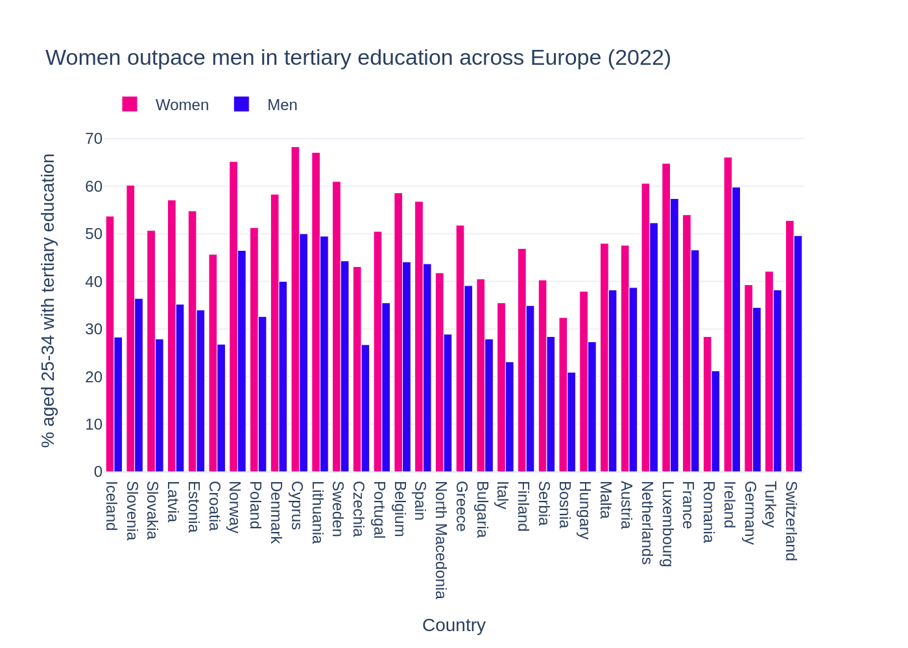
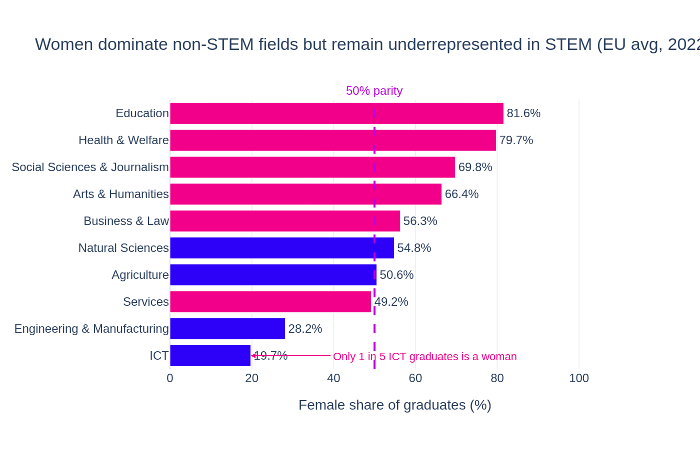

# The Education Paradox: Gender Gaps in European Higher Education

A data analysis project exploring the gender data gap in European 
higher education using open data from Eurostat.

### Key finding
Women outnumber men among university graduates across Europe, yet 
remain significantly underrepresented in STEM fields — particularly 
ICT (19.7%) and Engineering (28.2%).

---

### 1. Who graduates more?
Across almost all EU countries, women aged 30–34 have surpassed men 
in tertiary attainment — yet this advantage disappears entirely in 
technical fields.

---

### 2. Where is the gap largest?
The gender gap is not uniform across disciplines. STEM fields — 
especially ICT and Engineering — show a stark underrepresentation 
of women compared to fields like Education or Health.

---

### 3. Does it vary by country?
The pattern holds across countries, but Nordic nations show 
consistently smaller gaps — suggesting that policy environment 
and cultural norms play a significant role.

### Questions explored
- Do women outpace men in tertiary education across EU countries?
- Which fields of study show the largest gender gaps?
- How does the STEM gender gap vary across countries?

### Data sources
- [Eurostat — Tertiary graduates by sex and field](https://ec.europa.eu/eurostat)
- [Eurostat — Tertiary attainment by sex](https://ec.europa.eu/eurostat)

### How to run
1. Clone this repository
2. Install dependencies: `pip install -r requirements.txt`
3. Open `notebook.ipynb` in Jupyter

